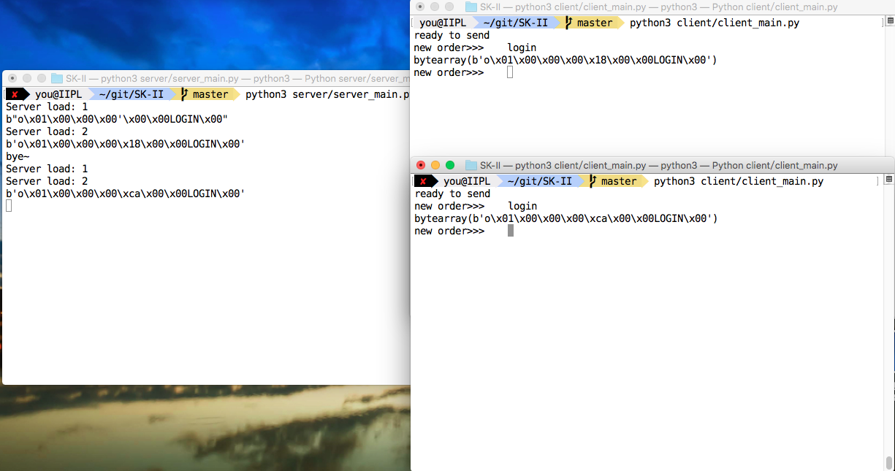

#   基于SOCKET的流播放器协议实现
##   数据通信与计算机网络课程项目

by 游沛杰 13307130325

---

##  实验要求 & 选题

在本次项目中我们通过socket API编程完成应用层协议开发.

因为不是很想做聊天室/编辑器, 所以我最后选择尝试使用socket实现一个 **音乐播放器**.

音乐播放服务器, 可以干什么呢?

-   节省本地磁盘容量(尤其对于手机等移动设备)
-   方便在不同设备上听音乐
-   可以通过播放时间等给用户计费
-   服务器不需要一直发数据, 可以sleep一段短的时间再发
-   ...

由于时间原因没能把所有想做的功能实现, 以下我主要介绍设计和部分实现情况.

##  SOCKET介绍
使用socket进行通信的原理详见助教实验课件.

在这里我们通过TCP建立的连接进行通信, 在TCP基础上实现应用层协议

#### configuration

-   Python 3
-   socket module
-   PyAudio
-   develop on Mac OS X
-   base on TCP
-   IDE: JetBrains PyCharm
-   no UI

---

##  协议介绍

在这里我设计了一套用于实现播放器的协议, 称为ATP(A Transfer Protocol).
计划支持播放, 录音, 控制等三个主要功能.
据了解目前流播放器使用的是RTP协议.

我在设计协议时主要考虑了可扩展性, 安全性, 和如何与已有HTTP应用结合在一起.

协议头部采用固定长度(8字节, 8B):

|---版本号 & magic number, 1B---|---类型1B---|---功能1B---|---flag, 1B---|---用户ID, 2B---|---资源ID, 2B---|---数据---|

以下是详细介绍

#### 版本号字段(version, 1Byte)

版本号格式为0x0110XXXX, 前4个比特为magic number, 用于标识帧的开始和验证.

后4位给出当前的版本号, 总共支持16个不同版本的ATP协议同时在网络上传输.

目前使用版本号为0x1111(因为0x01101111看上去比较好看)

#### 类型字段(type, 1Byte)

用类型字段大概标识出这是一个与哪个模块相关的帧.
各种取值含义如下:

<table>
<tbody>
<tr><td><em>type value </em></td><td><em>含义</em></td></tr>
<tr><td>0</td><td>播放器相关数据</td></tr>
<tr><td>1</td><td>控制相关数据</td></tr>
<tr><td>2</td><td>错误信息</td></tr>
<tr><td>3</td><td>录音相关</td></tr>
</tbody>
</table>

#### 功能字段(func, 1Byte)

在同一类型帧中区分出不同操作
播放器(type=0)
<table>
<tbody>
<tr><td><em>func value </em></td><td><em>含义</em></td></tr>
<tr><td>0</td><td>setup</td></tr>
<tr><td>1</td><td>play</td></tr>
<tr><td>2</td><td>pause</td></tr>
<tr><td>3</td><td>teardown</td></tr>
</tbody>
</table>

控制(type=1)
<table>
<tbody>
<tr><td><em>func value </em></td><td><em>含义</em></td></tr>
<tr><td>0</td><td>login</td></tr>
<tr><td>1</td><td>logout</td></tr>
<tr><td>2</td><td>encrypt</td></tr>
</tbody>
</table>

#### flag, 1Byte

<table>
<tbody>
<tr><td><em>flag bit </em></td><td><em>含义</em></td></tr>
<tr><td>0</td><td>是否为ACK帧</td></tr>
<tr><td>1</td><td>是否加密</td></tr>
<tr><td>2</td><td>数据是否有校验和</td></tr>
<tr><td>3</td><td>头部是否需要扩展</td></tr>
</tbody>
</table>

#### 用户标识(uid, 2Byte)

用于uid区分不同用户请求.

在启动应用的时候要求用户先登录再开始音乐服务, 用户先要告知服务器自己的身份---uid.
如果把我的ATP用在网页应用中, 这个uid可以通过HTTP请求获得.

在项目中, 我们让用户手工设置自己的uid.

#### 资源标识(did, 2Byte)

用于区分不同的音乐, 同上可以通过HTTP获得.

在项目中, 用户登录的时候服务器会返回一个用户可用的资源列表.

#### 如何确定长度?

在传输音频数据的时候我们希望知道有多长, 但是在传输控制命令的时候这个字段是不需要的.
我的实现方法是把长度信息放在音频数据中, 如收到声音的数据字段为

> 123 xxxxxxxx

其中123和后面的空格用ASCII/utf-8编码, 表示长度, 后面的字节流就是实际的数据

其他控制帧是 **固定长度** 的.

#### 校验信息
通过头部magic number(0x110)来辨别是否为一个ATP头部开始.
没有头部校验和.
数据的校验是可选选项, 通过flag来确定, 校验和包含在数据字段

#### 加密?
考虑到后续可能有加密需求, 在flag中有加密位, 但是没有实现.

可以考虑SSL等?

---

##  实现过程 & 实现细节

这里我们主要是client-server模型, 由client来首先发出指令, 然后通过server提供数据.

-   命令包括login, logout, setup, play, pause, teardown等.
-   login/logout分别是登入登出,在登出的时候服务器就可以断开这个socket连接了.
-   setup是播放音乐的准备阶段, 这时候服务器会返回一系列参数(如音频格式,采样频率等)帮助客户建立pyaudio对象来播放.
-   play指定从某个音乐的某个时间节点开始播放, 时间节点作为数据字段传输.
-   用户发送pause可以告诉服务器不需要再发数据了, 在暂停的时候减轻服务器负担.
-   通过teardown终结一个音乐的播放.

### SOCKET编程
Python3中的Socket模块提供了标准的BSD Socket API, 主要用到的函数如下:

-   sk = socket.socket(socket.AF_INET, socket.SOCK_STREAM, socket.IPPROTO_TCP), 创建新的socket对象
-   服务器用到的
    -   sk.bind((addr, port)), 绑定到指定端口
    -   sk.listen(2333), 监听端口
    -   conn, addr = sk.accept(), 收到数据建立连接, 返回新的连接的sk对象
-   客户端用到的
    -   sk.connect((addr, port))连接到服务器
-   sk.sendall(bytes), 发送比特流数据
-   sk.recv(buffersize), 接收数据

### 使用PyAudio
具体详见pyaudio文档

### 多线程
对于用户,需要有两个线程, 只用一个线程会出现阻塞(通过命令控制播放器的时候不能接收数据, 接收数据的时候不能控制).

1   一个负责接收socket数据(主要是持续不断的音频数据)
2   客户端播放器的控制

对应在服务器端, *对于每个用户连接* 也需要有两个线程

1.  周期性地发送音频数据并写到stream中播放
2.  接收来自用户的请求(如请求暂停发送等)

另外我们需要有一个线程来监听是否有新的用户连接进来, 如果accept则需要给他新建2个线程(如上所述)

通过前面的逻辑流程图我们发现这里需要用到大量的多线程♂知识.

线程的创建通过threading.Thread()完成, 由t.start()方法来开始线程, t.terminate()来结束线程.

服务器端的一个线程出错不会影响整体的运行(因为是多线程).

### 锁
实现过程中发现, 如果停止pyaudio.stream以后再往里面写数据会造成原来停止的播放器继续播放.
客户端中的播放线程和控制线程需要通过对共享数据--- **播放器状态** *加锁*来进行同步, 锁使用threading.Lock对象

##  How to run
necessary:

-   Python 3
-   PyAudio

optional

-   pip3(for installation)

use *apt-get* in Ubuntu/Debian, *homebrew* in Mac OS X for installation.

Installation solution for Windows user is not listed here.

to run the server, you should first config the server address and port in file share/CONFIG.py first:

by default, we use:
> server_address = '127.0.0.1'
> port = 0x91D

run in **root** directory of my project:
> python3 server/server_main.py

to run the client program
> python3 client/client_main.py

##  效果展示

因为没有开发出UI, 这里放几个终端运行结果.

声音请自行脑补 / 运行一下, 谢谢~

首先是播放音频1(星球大战-帝国进行曲), 我们可以看到其中发送的数据:

以下是多个用户登录时的情况

##  总结 & future
通过这次的项目我掌握了基本的socket编程.

其实我觉得使用TCP来传输音乐数据不太科学, 因为我现在的实现需要对每个用户维护一个长连接, 增加了服务器的开销.

针对组播, 广播也难以优化. 针对组播, 设想可以考虑对每个资源维护一个线程, 同时对多个用户发送数据.

本次项目从12月3号尝试python的socket开始, 历时20天, 虽然其中很多时间不是在做这个项目, 但是做出来的东西 *连UI都没有*, 需要考虑一下提升我的编程能力... 

---

##  Thank you!

感谢您的阅读!

You can:

-   view this project on GitHub: <a href="https://github.com/kjkszpj/SK-II">SK-II</a>

-   Please, view this report as markdown format.